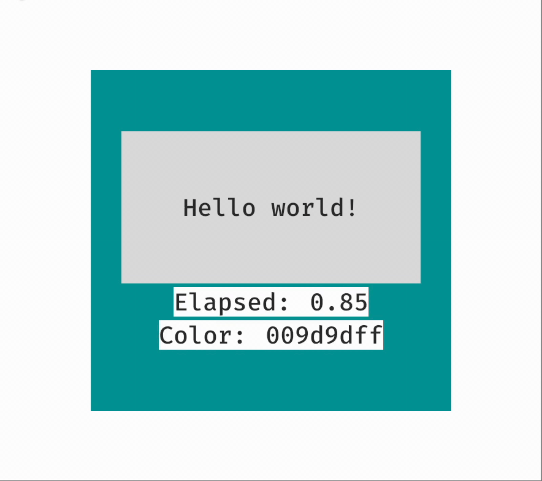

## About

`polako` is the big rethink of the application framework architecture in general and the [`one`](https://github.com/jkb0o/belly/issues/77) plugin for bevy in particular.
`polako` is built on the top of [`constructivism`](https://github.com/polako-rs/constructivism).

The `polako` is at the proof-of-concept state. It is possible to define the scene and its behavior with `eml!` macro ([complete example](./examples/ui.rs)):
```rust
fn hello_world(mut commands: Commands) {
    commands.spawn(Camera2dBundle::default());
    commands.add(eml! {
        resource(time, Time);
        bind(time.elapsed_seconds.fmt("{:0.2}") => elapsed.text);
        bind(time.elapsed_seconds * 0.5 - 0.5 => content.bg.r);
        bind(content.bg.hex => color.text);
        Body + Name { .value: "body" } [
            content: Column { .bg: #9d9d9d, .s.padding: [25, 50] }[
                Div { .bg: #dedede, .s.padding: 50 } [
                    "Hello world!"
                ],
                Row [
                    "Elapsed: ", elapsed: Label { .text: "0.00" }
                ],
                Row [
                    "Color: ", color: Label
                ]
            ]
        ]
    })
}
```



All elements (`Div`, `Label`, `Row`, etc) are implemented in [the example](./examples/ui.rs). The `eml!` is designed as tool-friendly-first macro, so a lot of autocomplete, doc strings, goto things are just works. Some of them not (yet).

There is no `polako_ui` crate yet. Only some parts of the `bevy` are implemented as `Elements`, see [bridge.rs](./crates/polako_constructivism/src/bridge.rs).


## Meaning

`Polako` is the identity, the lifestyle and the answer to every question of the Serbian people. It also can be translated from one as yet unknown ancient language as [42](https://en.wikipedia.org/wiki/Phrases_from_The_Hitchhiker%27s_Guide_to_the_Galaxy#Answer_to_the_Ultimate_Question_of_Life,_the_Universe,_and_Everything_(42)).

## License

The `polako` is dual-licensed under either:

- MIT License ([LICENSE-MIT](LICENSE-MIT) or [http://opensource.org/licenses/MIT](http://opensource.org/licenses/MIT))
- Apache License, Version 2.0 ([LICENSE-APACHE](LICENSE-APACHE) or [http://www.apache.org/licenses/LICENSE-2.0](http://www.apache.org/licenses/LICENSE-2.0))

This means you can select the license you prefer!
This dual-licensing approach is the de-facto standard in the Rust ecosystem and there are [very good reasons](https://github.com/bevyengine/bevy/issues/2373) to include both.